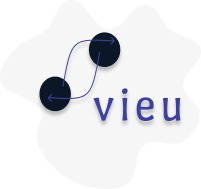
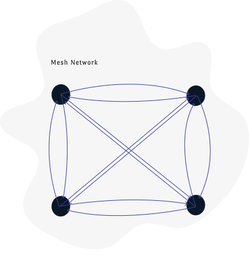

## Description

Vieu is a video chat application made using [React](https://reactjs.org/) powered by [webRTC](https://webrtc.org/), and uses [socket.io](https://socket.io/) as the signaling server on the [backend](https://github.com/sastaachar/vieu-server).

Webrtc natively supports peer-to-peer connection, and to accommodate a chat room experience , i've used a mesh architecture.

This type of architecture is not al all scalable, but since this project was made just for experimental purposes i've used this here , although for better scalability and performance a Selective Forwarding Unit or Multipoint Conferencing Unit can be considered, for more info check [here](https://www.callstats.io/blog/webrtc-architectures-explained-in-5-minutes-or-less).

The global state of the application is managed using Redux.

## Pages

### Main (landing)

### Join Room

### Chat Room

